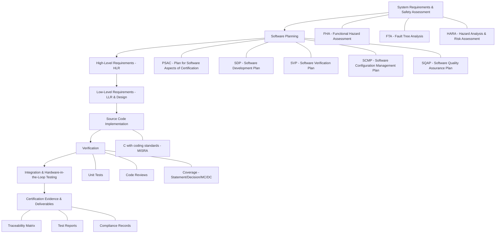

# Flight Control DO-178C Demo Project  
*A Reference Project for Safety-Critical Development Processes*  

This repository demonstrates how to develop software under **functional safety standards** such as **DO-178C** (airborne software), **ISO 26262** (automotive), **IEC 62304** (medical), and similar frameworks.  

It is structured to serve as both a **portfolio project** and a **future reference guide**.

---

## 📊 Typical Safety-Critical Development Process Flow Chart

Here's a flow chart of the typical safety-critical development process (aligned with **DO-178C, ISO 26262, IEC 62304**, etc.):



## 📑 Development Flow (Step by Step)

### 1. System Requirements & Safety Assessment  
- **Artifacts**: [System Requirements](docs/Requirements.md), Safety Assessment Notes  
- **Concepts**:  
  - **FHA** – Functional Hazard Assessment  
  - **FTA** – Fault Tree Analysis  
  - **HARA** – Hazard Analysis & Risk Assessment  
- **Goal**: Identify hazards, assign safety levels (DAL C in this project).  

---

### 2. Software Planning  
- **Artifacts**:  
  - [PSAC](docs/PSAC.md) – *Plan for Software Aspects of Certification*  
  - [SDP](docs/SDP.md) – *Software Development Plan*  
  - [SVP](docs/SVP.md) – *Software Verification Plan*  
  - [SCMP](docs/SCMP.md) – *Software Configuration Management Plan*  
  - [SQAP](docs/SQAP.md) – *Software Quality Assurance Plan*  
- **Goal**: Define *how* software will be developed, verified, managed, and assured.  

---

### 3. High-Level Requirements (HLR)  
- **Artifact**: [Requirements.md](docs/Requirements.md)  
- Example: *System shall maintain pitch within ±2° of target.*  
- **Goal**: Translate safety/system requirements into **software-level behavior statements**.  

---

### 4. Low-Level Requirements (LLR) & Design  
- **Artifacts**: [Design Diagrams](design/ArchitectureDiagram.png), State Machine  
- **Goal**: Specify module-level behavior and internal design decisions (algorithms, scheduling, interfaces).  

---

### 5. Source Code Implementation  
- **Artifacts**: [Source Code](src/) (C with MISRA-style guidelines)  
- **Goal**: Implement design in a safe, consistent, and reviewable manner.  

---

### 6. Verification  
- **Artifacts**:  
  - [Unit Tests](tests/)  
  - [Coverage Reports](tests/coverage_report/)  
  - [Review Checklists & Logs](reviews/)  
- **Concepts**:  
  - **RBT** – Requirements-Based Testing  
  - **Coverage** – Statement, Decision, and (if applicable) MC/DC  
- **Goal**: Demonstrate that each requirement is fully verified.  

---

### 7. Integration & Hardware-in-the-Loop (HIL) Testing  
- **Artifacts**: HIL Test Notes (future extension)  
- **Goal**: Validate system integration and real-time performance on hardware.  

---

### 8. Certification Evidence & Deliverables  
- **Artifacts**: [Traceability Matrix](docs/TraceabilityMatrix.xlsx), Test Reports  
- **Goal**: Show end-to-end traceability (HLR → LLR → Code → Test) and compliance with DO-178C objectives.  

---

## 📂 Repository Structure
```
flight-control-do178-demo/
├── docs/ → DO-178C plans, requirements, traceability
├── design/ → Diagrams (architecture, state machines)
├── src/ → Source code
├── tests/ → Unit tests & coverage
├── reviews/ → Checklists & review logs
└── README.md → This guide
```


---

## 🧾 Acronyms Reference

- **DO-178C** – Software Considerations in Airborne Systems and Equipment Certification  
- **DAL** – Design Assurance Level (A = most critical, E = least critical)  
- **PSAC** – Plan for Software Aspects of Certification  
- **SDP** – Software Development Plan  
- **SVP** – Software Verification Plan  
- **SCMP** – Software Configuration Management Plan  
- **SQAP** – Software Quality Assurance Plan  
- **FHA** – Functional Hazard Assessment  
- **FTA** – Fault Tree Analysis  
- **HARA** – Hazard Analysis and Risk Assessment  
- **RBT** – Requirements-Based Testing  
- **MC/DC** – Modified Condition / Decision Coverage  

---

